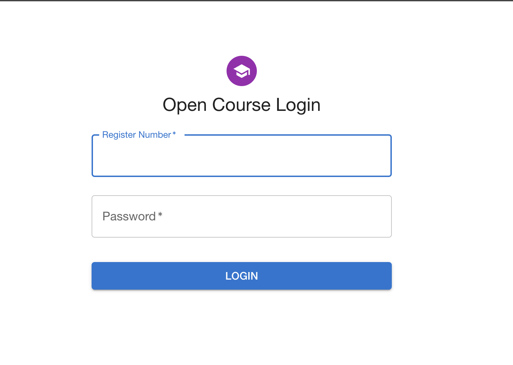

# OpenCourse Management Webapp

OpenCourse is a programme in our college where students of other deparments are given an oppertunity to learn courses out of their majors. The courses will be provided by other deparments of the college. The allotement of students to the courses is managed by this Webapp

## Screenshots



<!-- 
 -->

## Tech Stack

- **Client:** 
- **Server:**  
- **Database:** 

## Deployment

To deploy this project both frontend and backend locally

Clone the project

```bash
  git clone https://github.com/H4K3R13/opencourse-webapp.git
```

```bash
  cd opencourse-webapp
```

- opencourse-webapp
  - backend-script
  - open-frontend
  - openBackend

## Run Frontend Locally

After changing directory to root folder

```bash
  cd open-frontend
```

Install dependencies

```bash
  yarn install
```

Start the server

```bash
  yarn run dev
```

## Run Backend Locally

After changing directory to root folder

```bash
  cd openBackend
```

Install modules

```bash
  pip3  install -r requirements.txt 
```

Start the server

```bash
  python3 manage.py runserver
```

## API Reference

#### Handle submission of student

```http
  POST api/submit/
```

Playload Example

```json
{   
    "regno":"NAXXXXXXXX",
    "courseList": [
        ["Course1", 1],
        ["Course2", 2],
        ["Course3", 3],
        ["Course4", 4],
        ["Course5", 5]
    ]
}
  
```

### Login

```http
  POST /api/login/
```

Payload Example

```json
  {
        "username": "REGISTER_NUMBER",
        "password": "DATE_OF_BIRTH",  
  }
```

Passwords are set by default.

### Fetches details of a student

```http
  GET api/details/?regno=REGISTER_NUMBER
```

### Delete A Submission
```http
  DELETE /api/delete
```
Payload Example

```json
  {
      "regno":"REGISTER_NUMBER",
  }
```

### Fetches Number Of Seats
```http
  GET /openApi/api/seats
```

### Fetches Submission Details
```http
  GET /api/submissions
```

## Automation Scripts

```bash
backend-scipt/auto_data_entry.py  # Auto data entries

python3 manage.py create_user # Creates user

python3 manage.py delete_user # Deletes the user
```

<!-- ## To Do

Security issue in login page

Hi
Form Ui
  displaying the opencourses in a priority list where the numbers(priority on LHS) & course name in RHS 👍🏼
  once selected course should not be displayed in the dropdown 👍🏼

Submission of data
    submission to table in row wise 👍🏼

Sorting of data
    create a button in admin panel which will sort the data from OpenCourseChoice Table and downloads a CSV file. 👍🏼
      an upgradation to this saperate csv files download are per the requirement (using .zip)
Fixing admin panel
	Taking admin actions to react rather than django logins -->
